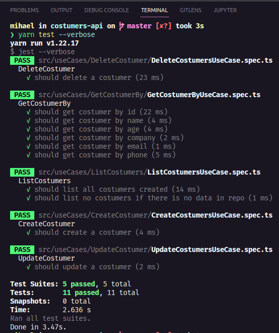

# Costumers API 👽

API desenvolvida para o teste de desenvolvedor da Pagaleve.

A partir dessa API, você pode:

- [x] Listar todos os costumers.
- [x] Recuperar um costumer por vez.
- [x] Editar informações de um costumer.
- [x] Criar um costumer.
- [x] Deletar um costumer.

## Stack

- [x] Node.JS
- [x] Typescript
- [x] MongoDB
- [x] Jest

## Organização

```
.
└── root/
    ├── log/
    └── src/
        ├── controllers/
        │   ├── DELETE/
        │   │   └── //controllers com este metodo
        │   ├── GET/
        │   │   └── //controllers com este metodo
        │   ├── PATCH/
        │   │   └── //controllers com este metodo
        │   ├── POST/
        │   │   └── //controllers com este metodo
        │   ├── repositories/
        │   │   └── //repositorios para MongoDB (prod) e Fake (testes)
        │   └── routes/
        │       ├── DELETE/
        │       │   └── //rotas com este metodo
        │       ├── GET/
        │       │   └── //rotas com este metodo
        │       ├── PATCH/
        │       │   └── //rotas com este metodo
        │       └── POST/
        │           └── //rotas com este metodo
        ├── entities/
        │   ├── builders/
        │   │   └── //padrão de projeto utilizado nos testes
        │   ├── DTOs/
        │   │   └── //transferência de tipos entre camadas
        │   ├── types/
        │   │   └── //tipos da aplicação
        │   └── validations/
        │       └── //funções de validação de dados
        ├── helpers/
        │   └── populate/
        │       └── //função de população do banco
        ├── infra/
        │   ├── containers/
        │   │   └── //registro de containers com tsyringe
        │   ├── database/
        │   │   └── //conexão com Mongo
        │   └── server.ts
        └── useCases/
            ├── CreateCostumer/
            │   ├── //useCase
            │   └── //teste automatizado
            ├── DeleteCostumer/
            │   ├── //useCase
            │   └── //teste automatizado
            ├── GetCostumerBy/
            │   ├── //useCase
            │   └── //teste automatizado
            ├── ListCostumers/
            │   ├── //useCase
            │   └── //teste automatizado
            └── UpdateCostumer/
                ├── //useCase
                └── //teste automatizado
```

A organização segue uma adaptação da arquitetura limpa, onde o coração da aplicação está dentro da camada de infra.

Juntamente a esta camada, existe o diretório de containers, onde fica o registro dos containers, um padrão de projeto utilizado para inversão e injeção de dependências quando se trata de banco de dados. A partir deles, é possível selecionar qual instância de banco cada use case vai utilizar, facilitando a utilização de múltiplas bases numa só aplicação. Além deste, existe o diretório database, que contém a conexão com o banco de produção utilizado.

Na camada de controllers, estão presentes os gateways pelos quais as requisições são feitas, e as rotas pelos quais os mesmos respondem. Além destes, os repositórios utilizados para inverter a dependência com ORMs. A partir de uma interface única, todo repositório deve implementar seus métodos seguindo os métodos do ORM utilizado. Dessa forma, todo use case implementará a chamada de um único método para uma única ação, sem necessidade de adaptações para ORMs específicos.

Para os use cases, cada um possui seu diretório específico, sendo eles:

- CreateCostumer: cria um costumer correspondente a entidade Costumer.
- DeleteCostumer: remove um costumer da base dado seu _id.
- GetCostumerBy: retorna um costumer a partir de um de seus atributos, especificado nos parametros da chamada.
- ListCostumers: lista todos os costumers da base.
- UpdateCostumer: atualiza dados de um determinado costumer.

Cada um dos use cases possui junto a ele um teste unitário automatizado com Jest. Abaixo, o resultado do comando ```yarn test --verbose```:



Na camada de entidades, estão os artefatos relacionados as entidades da aplicação, sendo eles:

- builders: construtores de objetos de uma entidade específica. Padrão de projeto utilizado para otimizar a implementação de testes.

- DTOs: objeto que simula campos de uma entidade, utilizada para transportar a descrição dos campos dessa entidade para outras camadas.

- types: tipos implementados para padronizar dados de uma entidade.

- validations: funções que validam dados de uma entidade em casos especificos.

Além destas, uma camada extra chamada helpers, que possui scripts que podem ser utilizados por todas as outras camadas, sendo estes úteis a essas.

## Execução

Você deve ter [Docker](https://www.docker.com/) ou [Node.JS](https://nodejs.org/en/) instalados.

Para execuções com Docker, na raiz do projeto:

```
$ docker build -t costumers-api .
$ docker run -it -p 8888:8888 -e PORT=8888 -e DB_CONN_STRING="mongodb+srv://pagaleve_teste:<pass>@cluster0.lumgc.mongodb.net/?retryWrites=true&w=majority&ssl=true" -e DB_NAME="pagaleve_teste" -e COLLECTION_NAME="costumers" test-costumers-api
```

Para execuções com Node:

```
$ yarn dev
```

## Demo

A API está implantada [aqui](https://costumers-api.herokuapp.com/health-check)

## Postman dump

No diretório postman existe um dump que pode ser utilizado para testar a API e assim entende-la melhor.

## Dúvidas

Caso existam dúvidas, pode falar comigo pelo [Linkedin](https://linkedin.com/in/pedromihael).

Cuide-se! 🤘🏽